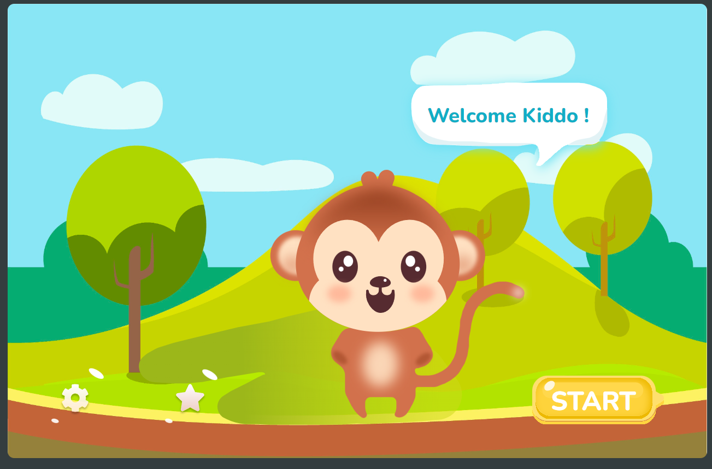

# brightchamps fruits matching game project



## Hosted Version of the Project:

[brightchamps fruits matching game project](https://brightchamps-fruits-matching-game-project.vercel.app/)

## Objectives

task is to create an engaging matching game using React.js with TypeScript,
following the design provided in Figma. In this game, players will test their memory
and skills by matching items within a defined number of tries, with a set limit. Upon
successful matches, players will collect a banana, which will be prominently
displayed on the final screen. Data for the game can be dynamically sourced from
either a JSON file or a database.

## How to install and run in yours local machine

```bash
npm install
npm run start
```

## Tech. Stack Used:

- [React](https://react.dev/)
- [TailwindCSS](https://tailwindcss.com/)
- [Google Fonts](https://fonts.google.com/)
- [Font Awesome](https://fontawesome.com/icons/)

## Author

[Abhishek kumar](https://www.linkedin.com/in/alex21c/), ([Geekster](https://geekster.in/) MERN Stack FS-14 Batch)
